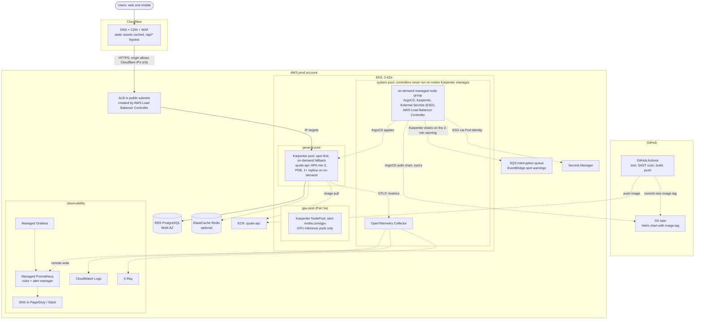

# quote-api on AWS (bonus)

Same patterns as the local setup, on EKS. Solid arrows: requests and data. Dotted: control, delivery, telemetry.

```mermaid
flowchart TB
  user(["Users: web and mobile"])

  subgraph cf["Cloudflare"]
    cdn["DNS + CDN + WAF<br/>static assets cached, /api/* bypass"]
  end

  subgraph gh["GitHub"]
    gha["GitHub Actions<br/>test, SAST scan, build, push"]
    repo["Git repo<br/>Helm chart with image.tag"]
  end

  subgraph aws["AWS prod account"]
    alb["ALB in public subnets<br/>created by AWS Load Balancer Controller"]
    subgraph eks["EKS, 3 AZs"]
      subgraph sys["system pool: controllers never run on nodes Karpenter manages"]
        ctrl["on-demand managed node group<br/>ArgoCD, Karpenter, External Secrets (ESO),<br/>AWS Load Balancer Controller"]
        otel["OpenTelemetry Collector"]
      end
      subgraph gen["general pool"]
        api["Karpenter pool: spot first, on-demand fallback<br/>quote-api: HPA min 3, PDB, 1+ replica on on-demand"]
      end
      subgraph gpu["gpu pool (Part 5a)"]
        infer["Karpenter NodePool, taint nvidia.com/gpu<br/>GPU inference pods only"]
      end
    end
    rds[("RDS PostgreSQL<br/>Multi-AZ")]
    redis[("ElastiCache Redis<br/>optional")]
    ecr["ECR: quote-api:<git sha>"]
    sqs["SQS interruption queue<br/>EventBridge spot warnings"]
    sm["Secrets Manager"]
    subgraph obs["observability"]
      amp["Managed Prometheus<br/>rules + alert manager"]
      amg["Managed Grafana"]
      logs["CloudWatch Logs"]
      xray["X-Ray"]
      sns["SNS to PagerDuty / Slack"]
    end
  end

  user --> cdn
  cdn -->|"HTTPS, origin allows Cloudflare IPs only"| alb
  alb -->|"IP targets"| api
  api --> rds
  api -.-> redis

  gha -.->|"push image"| ecr
  gha -.->|"commit new image.tag"| repo
  ctrl -.->|"ArgoCD pulls chart, syncs"| repo
  ctrl -.->|"ArgoCD applies"| api
  api -.->|"image pull"| ecr
  ctrl -.->|"Karpenter drains on the 2-min warning"| sqs
  ctrl -.->|"ESO via Pod Identity"| sm

  api -.->|"OTLP, /metrics"| otel
  otel -.->|"remote write"| amp
  otel -.-> logs
  otel -.-> xray
  amg -.-> amp
  amp -.-> sns
```
